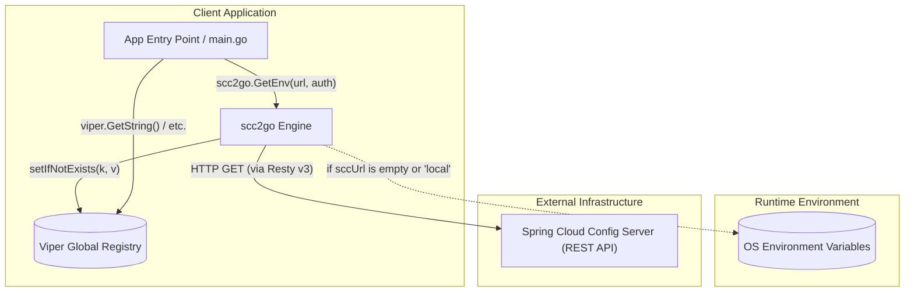

# Architecture & Technical Design

## 1. Component Architecture & System Boundaries

`scc2go` adalah library/client Go minimalis yang berfungsi sebagai adapter antara **Spring Cloud Config Server** dan **Viper** configuration registry di dalam runtime aplikasi Go.



- **Runtime Mode Switch**:
  - `sccUrl == ""` atau `sccUrl == "local"`: Mengaktifkan mode lokal/fallback yang membaca variabel lingkungan OS (`os.Environ()`).
  - `sccUrl` berupa HTTP/HTTPS URL: Melakukan request GET ke endpoint Spring Cloud Config.

---

## 2. Request & Data Flow

### Spring Cloud Config Fetch Flow
```
[Application Startup]
       │
       ▼
scc2go.GetEnv(sccUrl, auth, disableTlsOpt...)
       │
       ▼
scc2go.GetEnvWithDebug(sccUrl, auth, debug, disableTlsOpt...)
       │
       ├─── [sccUrl == "" || sccUrl == "local"] ───────► loadFromEnv()
       │                                                      │
       │                                                      ▼
       │                                                os.Environ() -> lower & '_' to '.'
       │                                                      │
       │                                                      ▼
       │                                                setIfNotExists() -> viper.Set()
       │
       ▼ [sccUrl valid]
getSCC(sccUrl, auth, disableTls)
       │
       ├─── Resty v3 Client initialized (Timeout: 5s, Retries: 3, RetryWait: 1s)
       ├─── Header: "Authorization: <auth>"
       ├─── TLS: InsecureSkipVerify (jika disableTls=true)
       └─── Execute GET request
       │
       ▼
JSON Unmarshal response into springCloudConfig struct
       │
       ▼
Iterate PropertySources in reverse order:
       for i := len(scc.PropertySources) - 1; i >= 0; i--
       │
       ▼
Iterate key-value in source:
       setIfNotExists(key, value) -> if !viper.IsSet(key) { viper.Set(key, value) }
       │
       ▼
[Completed: Configurations available in viper.*]
```

---

## 3. Concurrency & Resource Management

- **Model Konkurensi**: Bersifat sinkron (*synchronous blocking call*). Tidak ada goroutine internal yang di-*spawn* secara asinkron.
- **Client Lifecycle**: Resty HTTP client dibuat per-pemanggilan `getSCC()` dan langsung ditutup dengan `defer client.Close()`.
- **Thread-Safety & Viper Mutex**:
  - `viper` global instance menggunakan internal mutex untuk operasi `viper.Set` dan `viper.IsSet`.
  - Pemanggilan `scc2go.GetEnv` dirancang untuk dipanggil pada fase bootstrap atau `func init()` sebelum goroutine worker lain mengakses Viper.
- **Resource Limits & Timeouts**:
  - HTTP Request Timeout: `5 * time.Second` (`CONFIRMED: scc2go.go:133`).
  - Retry Policy: 3 kali percobaan ulang dengan jeda 1 detik (`CONFIRMED: scc2go.go:134-135`).

---

## 4. Error Handling & Fault Tolerance

- **Error Strategy**:
  - **Graceful / Fail-Safe Logging**: Error jaringan HTTP atau kegagalan `json.Unmarshal` dicatat ke logger (`logger.Error()`) dan fungsi kembali (*early return*) tanpa menghentikan proses aplikasi (`panic`) atau me-return `error`.
  - `CONFIRMED: scc2go.go:78-83, 87-91`:
    ```go
    resBody, err := getSCC(sccUrl, auth, disableTls)
    if err != nil {
        logger.Error().Err(err).Msg("error when get scc")
        return
    }
    ```
- **Retry Mechanism**: Resty v3 secara otomatis melakukan retry hingga 3x jika koneksi HTTP gagal (`CONFIRMED: scc2go.go:134`).
- **Precedence Preservation**: Menggunakan fungsi pembantu `setIfNotExists` untuk memastikan bahwa konfigurasi yang sudah didefinisikan sebelumnya di Viper tidak tertimpa oleh sumber yang memiliki prioritas lebih rendah.

---

## 5. Observability & Telemetry

- **Structured Logging**: Menggunakan `github.com/rs/zerolog`.
  - Global time format: `zerolog.TimeFieldFormat = zerolog.TimeFormatUnix`.
  - Component context tag: `Str("component", "scc_loader")`.
  - Level logging dikendalikan parameter `debug`:
    - `debug == false`: `zerolog.InfoLevel`
    - `debug == true`: `zerolog.TraceLevel` (menampilkan detail log setiap property key yang dibaca).
- **Correlation / Tracing / Metrics**: `UNKNOWN` — Saat ini belum ada integrasi OpenTelemetry, Prometheus metrics, atau trace context propagation.

---

## 6. Data & Domain Boundaries

- **DTO Structs**:
  - `springCloudConfig`: Merefleksikan payload JSON resmi Spring Cloud Config Server:
    - `name` (string)
    - `profiles` ([]string)
    - `label` (string)
    - `version` (string)
    - `state` (string)
    - `propertySources` ([]propertySource)
  - `propertySource`:
    - `name` (string)
    - `source` (map[string]any)
- **Data Mapping**:
  - JSON property values bertipe `map[string]any` dipetakan langsung apa adanya ke tipe data internal Viper.
  - Untuk mode environment variables, pemetaan dilakukan dengan merubah `_` menjadi `.` dan mengubah string menjadi lowercase (`EXAMPLE_VAR` -> `example.var`).
