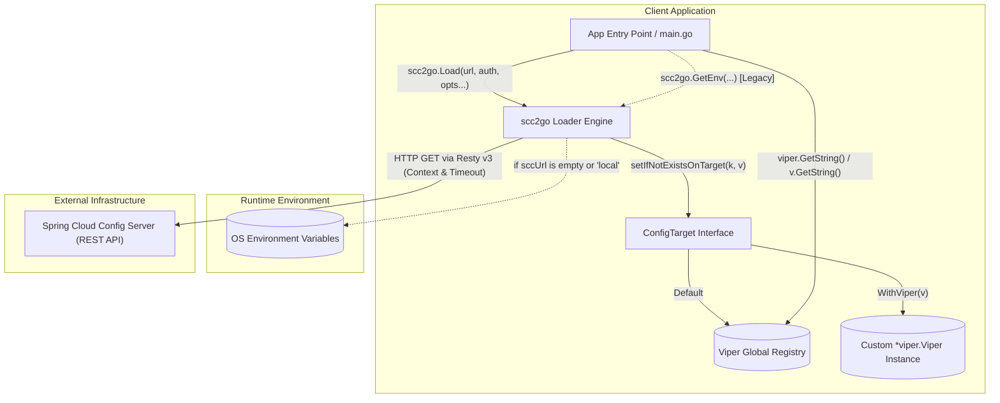

# Architecture & Technical Design

## 1. Component Architecture & System Boundaries

`scc2go` adalah library/client Go minimalis yang berfungsi sebagai adapter antara **Spring Cloud Config Server** dan konfigurasi **Viper** (`*viper.Viper` instance atau global registry) di dalam runtime aplikasi Go.


```mermaid
graph TD
    subgraph Client Application
        AppMain["App Entry Point / main.go"] -->|"scc2go.Load(url, auth, opts...)"| SCC2GO["scc2go Loader Engine"]
        AppMain -.->|"scc2go.GetEnv(...) [Legacy]"| SCC2GO
        SCC2GO -->|"setIfNotExistsOnTarget(k, v)"| Target["ConfigTarget Interface"]
        Target -->|"Default"| ViperReg[("Viper Global Registry")]
        Target -->|"WithViper(v)"| CustomViper[("Custom *viper.Viper Instance")]
        AppMain -->|"viper.GetString() / v.GetString()"| ViperReg
    end

    subgraph Runtime Environment
        EnvVars[("OS Environment Variables")]
    end

    subgraph External Infrastructure
        SCCServer["Spring Cloud Config Server (REST API)"]
    end

    SCC2GO -.->|"if sccUrl is empty or 'local'"| EnvVars
    SCC2GO -->|"HTTP GET via Resty v3 (Context & Timeout)"| SCCServer
```

- **Runtime Mode Switch**:
  - `sccUrl == ""` atau `sccUrl == "local"`: Mengaktifkan mode lokal/fallback yang membaca variabel lingkungan OS (`os.Environ()`) dan memetakannya ke target Viper.
  - `sccUrl` berupa HTTP/HTTPS URL: Melakukan request GET ke endpoint Spring Cloud Config.
- **Target Abstraction**:
  - Menggunakan interface `ConfigTarget` (`IsSet(key string) bool`, `Set(key string, value any)`) sehingga konfigurasi dapat disuntikkan ke singleton global `viper` (default) atau custom `*viper.Viper` via `WithViper(v)`.

---

## 2. Request & Data Flow

### Spring Cloud Config Fetch Flow
```
[Application Startup]
       │
       ▼
scc2go.Load(sccUrl, auth, opts...)  /  scc2go.GetEnv(sccUrl, auth, disableTlsOpt...)
       │
       ▼
Evaluate Functional Options:
  - WithContext(ctx)         (default: context.Background())
  - WithViper(v)             (default: globalViperTarget)
  - WithTimeout(duration)    (default: 5s)
  - WithDebug(bool)          (default: false)
  - WithDisableTLS(bool)     (default: false)
       │
       ├─── [sccUrl == "" || sccUrl == "local"] ───────► loadFromEnvToTarget(target)
       │                                                      │
       │                                                      ▼
       │                                                os.Environ() -> lower & '_' to '.'
       │                                                      │
       │                                                      ▼
       │                                                setIfNotExistsOnTarget() -> target.Set()
       │
       ▼ [sccUrl valid]
getSCCWithContext(ctx, sccUrl, auth, disableTls, timeout)
       │
       ├─── Resty v3 Client initialized (Timeout: cfg.timeout, Retries: 3, RetryWait: 1s)
       ├─── Header: "Authorization: <auth>"
       ├─── Context attached: req.SetContext(ctx)
       ├─── TLS: InsecureSkipVerify (jika disableTls=true)
       └─── Execute GET request
       │
       ▼ [Check HTTP Status]
       ├─── [Status Failure / Non-2xx] ───────────────► Return error ("fail get config...")
       │
       ▼ [Status OK]
JSON Unmarshal response into springCloudConfig struct
       ├─── [Unmarshal Error] ────────────────────────► Return error ("unmarshal failed...")
       │
       ▼ [Unmarshal OK]
Iterate PropertySources in reverse order:
       for i := len(scc.PropertySources) - 1; i >= 0; i--
       │
       ▼
Iterate key-value in source:
       setIfNotExistsOnTarget(key, value) -> if !target.IsSet(key) { target.Set(key, value) }
       │
       ▼
[Completed: Configurations available in Viper, returns nil]
```

---

## 3. Concurrency & Resource Management

- **Model Konkurensi**: Bersifat sinkron (*synchronous blocking call*). Tidak ada background goroutine yang di-*spawn*.
- **Client Lifecycle**: Resty HTTP client dibuat per-pemanggilan `getSCCWithContext()` dan langsung dibersihkan dengan `defer client.Close()`.
- **Cancellation & Dynamic Timeout**:
  - Mendukung `context.Context` via `WithContext(ctx)` sehingga caller dapat membatalkan fetch HTTP secara anggun (*graceful cancellation*).
  - Mendukung custom HTTP timeout via `WithTimeout(d)`.
- **Thread-Safety & Viper Mutex**:
  - `viper` (baik global singleton maupun `*viper.Viper`) menggunakan internal mutex untuk operasi `Set` dan `IsSet`.
  - Dukungan `WithViper` memfasilitasi pembuatan instance Viper terisolasi untuk konkurensi multi-tenant atau pengujian paralel tanpa race condition.
- **Resource Limits & Timeouts**:
  - Default HTTP Timeout: `5 * time.Second` (`CONFIRMED: scc2go.go:119`).
  - Retry Policy: 3 kali percobaan ulang dengan jeda 1 detik (`CONFIRMED: scc2go.go:224-225`).

---

## 4. Error Handling & Fault Tolerance

- **Error Strategy**:
  - **Deterministic Error Return (`Load`)**: Kesalahan HTTP (status failure) atau corrupt JSON unmarshal mengembalikan `error` eksplisit ke caller (`CONFIRMED: scc2go.go:150-164`).
  - **Fail-Safe Legacy Compatibility (`GetEnv` & `GetEnvWithDebug`)**: Membungkus pemanggilan `Load` dan mengabaikan nilai return error (`_ = Load(...)`), sehingga backward compatibility bagi caller lama tetap terjaga.
- **Retry Mechanism**: Resty v3 secara otomatis melakukan retry hingga 3x jika koneksi HTTP gagal (`CONFIRMED: scc2go.go:224`).
- **Precedence Preservation**: Menggunakan fungsi pembantu `setIfNotExistsOnTarget` untuk memastikan konfigurasi yang bernilai lebih spesifik tidak tertimpa oleh property source dengan prioritas lebih rendah.

---

## 5. Observability & Telemetry

- **Structured Logging**: Menggunakan `github.com/rs/zerolog`.
  - Global time format: `zerolog.TimeFieldFormat = zerolog.TimeFormatUnix`.
  - Component context tag: `Str("component", "scc_loader")`.
  - Level logging dikendalikan parameter `debug`:
    - `debug == false`: `zerolog.InfoLevel`
    - `debug == true`: `zerolog.TraceLevel` (menampilkan detail log setiap property key yang dibaca).
- **Correlation / Tracing / Metrics**: `UNKNOWN` — Saat ini belum ada integrasi OpenTelemetry, Prometheus metrics, atau trace context propagation.

---

## 6. Data & Domain Boundaries

- **DTO Structs**:
  - `springCloudConfig`: Merefleksikan payload JSON resmi Spring Cloud Config Server:
    - `name` (string)
    - `profiles` ([]string)
    - `label` (string)
    - `version` (string)
    - `state` (string)
    - `propertySources` ([]propertySource)
  - `propertySource`:
    - `name` (string)
    - `source` (map[string]any)
- **Data Mapping**:
  - JSON property values bertipe `map[string]any` dipetakan langsung apa adanya ke tipe data internal Viper.
  - Untuk mode environment variables, pemetaan dilakukan dengan merubah `_` menjadi `.` dan mengubah string menjadi lowercase (`EXAMPLE_VAR` -> `example.var`).
